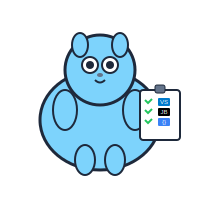

<div align="center">
  

  # Taskporter

  **Cross-Editor CLI Task Bridge** • *Inspired by Death Stranding*

  [](https://github.com/yourusername/taskporter/actions)
  [](https://goreportcard.com/report/github.com/yourusername/taskporter)
  [](https://github.com/yourusername/taskporter/releases)

  *A Golang-powered CLI tool that acts as a "porter" for project automation, bridging and running tasks from various code editors directly from the terminal.*
</div>

## 🎮 What is Taskporter?

Taskporter is a **cross-editor task bridge** that unifies task execution across different IDEs and editors. Just like Sam Porter Bridges connects isolated cities in Death Stranding, Taskporter connects your development tools, allowing you to run VSCode tasks, launch configurations, and JetBrains run configurations from a single, unified CLI.

**No more context switching.** **No more remembering different IDE shortcuts.** **Just one command to rule them all.**

## ✨ Features

### 🎯 **Multi-Editor Support**
- **VSCode Tasks** - Parse and execute `.vscode/tasks.json`
- **VSCode Launch Configs** - Run `.vscode/launch.json` configurations with preLaunchTask support
- **JetBrains IDEs** - Execute `.idea/runConfigurations/*.xml` (IntelliJ, WebStorm, GoLand, etc.)
- **Auto-Discovery** - Automatically detects all configuration files in your project

### 🚀 **Smart Execution**
- **Environment Variables** - Full support with workspace path resolution
- **Working Directory** - Respects each task's configured working directory
- **PreLaunchTasks** - Automatically runs dependent tasks before launch configs
- **Variable Resolution** - Handles `${workspaceFolder}`, `$PROJECT_DIR$`, and more

### 🎨 **Developer Experience**
- **Smart Matching** - Find tasks by exact name, case-insensitive, or partial match
- **Verbose Mode** - See all environment variables and execution details
- **JSON Output** - Perfect for CI/CD integration
- **Death Stranding Theme** - Enjoy "strand established" success messages

### 📋 **Task Discovery**
```bash
# List all available tasks and launch configs
taskporter list

# Get detailed scanning information
taskporter list --verbose

# JSON output for scripts and CI/CD
taskporter list --json
```

## 🛠 Installation

### Using Go Install
```bash
go install github.com/yourusername/taskporter@latest
```

### Download Binary
Download the latest release for your platform from [GitHub Releases](https://github.com/yourusername/taskporter/releases).

### Build from Source
```bash
git clone https://github.com/yourusername/taskporter.git
cd taskporter
make build
```

## 🚀 Quick Start

1. **Navigate to your project** with VSCode `.vscode/` or JetBrains `.idea/` directories
2. **List available tasks**:
   ```bash
   taskporter list
   ```
3. **Run a task**:
   ```bash
   taskporter run build
   taskporter run "Debug Application"
   taskporter run test --verbose
   ```

## 📖 Usage Examples

### VSCode Tasks Example
```json
// .vscode/tasks.json
{
  "tasks": [
    {
      "label": "build",
      "type": "shell",
      "command": "go",
      "args": ["build", "-o", "bin/app"],
      "group": "build",
      "env": {
        "CGO_ENABLED": "0"
      }
    }
  ]
}
```

```bash
taskporter run build
# ✅ Strand established! Task 'build' completed successfully
```

### VSCode Launch Configuration Example
```json
// .vscode/launch.json
{
  "configurations": [
    {
      "name": "Launch Server",
      "type": "go",
      "request": "launch",
      "program": "${workspaceFolder}/cmd/server",
      "env": {
        "PORT": "8080"
      },
      "preLaunchTask": "build"
    }
  ]
}
```

```bash
taskporter run "Launch Server"
# Runs 'build' task first, then launches the server
```

### JetBrains Run Configuration Example
```xml
<!-- .idea/runConfigurations/Application.xml -->
<component name="ProjectRunConfigurationManager">
  <configuration name="Run Main" type="Application">
    <option name="MAIN_CLASS_NAME" value="com.example.Main" />
    <option name="PROGRAM_PARAMETERS" value="--debug" />
    <envs>
      <env name="ENV" value="development" />
    </envs>
  </configuration>
</component>
```

```bash
taskporter run "Run Main"
# Executes the JetBrains Application configuration
```

## 🎛 CLI Reference

### Commands

#### `taskporter list`
Lists all discovered tasks and launch configurations.

**Flags:**
- `--verbose` - Show detailed scanning information
- `--json` - Output in JSON format for CI/CD integration

**Example Output:**
```
📋 Discovered Tasks & Launch Configurations

VSCode Tasks (.vscode/tasks.json):
  • build [build] - go build -o bin/app
  • test [test] - go test ./...
  • lint [none] - golangci-lint run

VSCode Launch (.vscode/launch.json):
  • Launch Server [launch] - Launch: /path/to/cmd/server
  • Debug Tests [launch] - Launch: ${workspaceFolder}/cmd/test

JetBrains (.idea/runConfigurations/):
  • Run Main [run] - Application: com.example.Main
  • Gradle Build [run] - Gradle: build

✅ Found 7 configurations across 3 sources
```

#### `taskporter run <task-name>`
Executes the specified task or launch configuration.

**Arguments:**
- `<task-name>` - Name of task (supports exact, case-insensitive, and partial matching)

**Flags:**
- `--verbose` - Show environment variables and detailed execution info

**Examples:**
```bash
# Exact match
taskporter run build

# Case-insensitive
taskporter run BUILD

# Partial match
taskporter run "launch"  # matches "Launch Server"

# With verbose output
taskporter run test --verbose
```

### Global Flags
- `--help` - Show help information
- `--version` - Show version information

## 🏗 Supported Configurations

### VSCode Tasks (`tasks.json`)
- ✅ All task types (shell, process, custom)
- ✅ Groups (build, test, etc.)
- ✅ Environment variables
- ✅ Working directory (`cwd`)
- ✅ Workspace variables (`${workspaceFolder}`)
- ✅ Complex argument arrays

### VSCode Launch Configurations (`launch.json`)
- ✅ Go launch configurations
- ✅ Node.js launch configurations
- ✅ Python launch configurations
- ✅ Environment variables
- ✅ PreLaunchTask execution
- ✅ Workspace variable resolution
- ✅ Program arguments

### JetBrains Run Configurations (`.idea/runConfigurations/*.xml`)
- ✅ Application configurations
- ✅ Gradle configurations
- ✅ Environment variables
- ✅ Program parameters
- ✅ JetBrains variables (`$PROJECT_DIR$`, `$MODULE_DIR$`)
- ✅ Working directory

## 🔧 Development

### Prerequisites
- Go 1.21+
- Make

### Development Commands
```bash
# Run tests
make test

# Run tests with coverage
make test-coverage

# Build binary
make build

# Run linter
make lint

# Run all checks (test + lint)
make check

# Clean build artifacts
make clean
```

### Project Structure
```
taskporter/
├── cmd/                    # CLI commands
│   ├── root.go            # Root command
│   ├── list.go            # List command
│   └── run.go             # Run command
├── internal/
│   ├── config/            # Configuration types
│   ├── parser/            # File parsers
│   │   ├── vscode/        # VSCode tasks & launch
│   │   └── jetbrains/     # JetBrains XML configs
│   └── runner/            # Task execution
├── test/                  # Test data and fixtures
└── .github/               # CI/CD and assets
```

## 🤝 Contributing

We welcome contributions! Please see our [Contributing Guidelines](CONTRIBUTING.md) for details.

### Adding New IDE Support
Taskporter is designed to be extensible. To add support for a new IDE:

1. Create a new parser in `internal/parser/youride/`
2. Implement the parser interface
3. Add detection logic in `internal/config/project_detector.go`
4. Add integration to `cmd/list.go` and `cmd/run.go`
5. Add comprehensive tests

## 📄 License

This project is licensed under the MIT License - see the [LICENSE](LICENSE) file for details.

## 🎮 Death Stranding Inspiration

*"A strand is a rope, a cord, a chain of connection. In Death Stranding, strands connect isolated cities. In Taskporter, strands connect isolated development tools."*

Taskporter draws inspiration from Death Stranding's theme of connection and bridging isolated communities. Just as Sam Porter Bridges reconnects America, Taskporter reconnects your development workflow.

---

<div align="center">
  <strong>🎯 Bridge your development workflow. Connect your tools. Deliver your code.</strong>

  **Made with ❤️ and ☕ by the Taskporter community**
</div>
